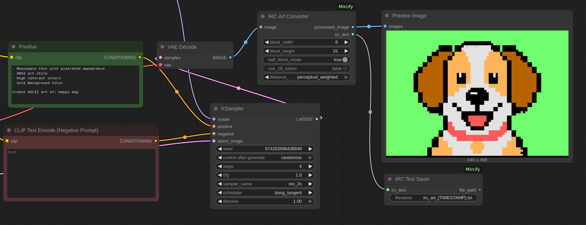
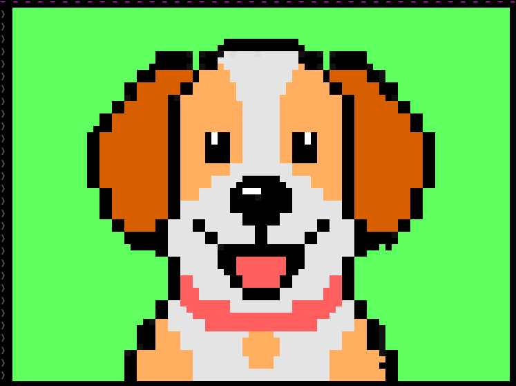

# ComfyUI-Mircify

A ComfyUI custom node for converting images into IRC art by processing them in pixel blocks and generating image and text outputs with optimal color selection from a 99-color IRC palette. Now supports both IRC and ANSI terminal text outputs for maximum compatibility.

This node is used with [aibird](https://github.com/birdneststream/aibird) to convert text prompts to IRC art that is scrolled in the IRC client, and can also output ANSI-formatted text for terminal display.

## Limitations

- As we have a limited color palette of 99 colors, at times some colors may not match perfect. Overall it matches good enough. I've found the `perceptual_weighted` followed by `weighted_manhattan` to be best.
- 16 colors don't work too well, but I've added this for legacy compatibility with some IRC clients that do not support 99 colors.
- IRC has a `512 - (ident + host)` byte limit per line. If there's too many half blocks rendered, it may go over this limit and break the display of the ASCII art. Rendering the image with a solid background color can help with this, or using fullblock mode.
- I haven't tried with many widths and heights. The current `640px x 448px` is a good fit for making ASCII art that is 80 character blocks wide and 30 character blocks hight. A smaller aspect ratio would fit a lot of half blocks better.

## Workflow



An example workflow is provided in `workflows/mircify_example_workflow.json`.

At the moment this example is using qwen image (gguf), lightning 4 step lora with RES4LYF samplers. However any model that is decent at making pixel ansi style art can suffice.

## IRC Output

Pasting the results of the created `.txt` file into IRC, we should be able to see the IRC art rendered in the client.



## ANSI Terminal Output

The node now also generates ANSI-formatted text that can be displayed directly in terminals with 256-color support. The ANSI output uses:

- **256-color palette**: Maps IRC colors to the closest ANSI 256-color equivalents using RGB distance calculations
- **Background colors with spaces**: Creates solid color blocks for consistent rendering
- **Half-block support**: Uses the ▀ character with foreground/background colors for different top/bottom colors
- **Automatic color reset**: Properly resets colors at the end of each line

To view ANSI output in a terminal:
```bash
cat output/irc_art/your_ansi_file.txt
```

or display it with `less -R` to preserve colors:
```bash
less -R output/irc_art/your_ansi_file.txt
```

## Features

- **Universal Image Support**: Works with any image dimensions, but remember the IRC 512 byte limit per line.
- **Color Transfer Integration**: Uses KMeans clustering with multiple distance methods for accurate color mapping
- **Block Processing**: Configurable block sizes (default 8x15 pixels)
- **Half Block Mode**: Option for 8x7.5 pixel blocks for finer resolution
- **Dominant Color Extraction**: Uses k-means clustering to find the most prominent color in each block
- **Multiple Distance Methods**: Choose between weighted manhattan, manhattan, euclidean, and perceptual weighted distance calculations
- **99-Color IRC Palette**: Maps colors to extended IRC color palette
- **16-Color Compatibility Mode**: Option to use traditional 16-color IRC palette
- **Dual Text Output**: Returns both IRC-formatted and ANSI-formatted text
- **ANSI Terminal Support**: Generate ANSI escape sequences for terminal display with 256-color accuracy
- **Intelligent Output Generation**: Only generates text outputs that are connected, optimizing performance
- **Optimized Text Output**: Compressed color codes and space-efficient formatting for both IRC and ANSI
- **Text File Export**: Save IRC codes directly to text files with timestamp support

## Installation

1. Clone or download this repository to your ComfyUI `custom_nodes` directory:
   ```bash
   cd ComfyUI/custom_nodes
   git clone https://github.com/birdneststream/ComfyUI-Mircify
   ```

2. Install dependencies:
   ```bash
   cd ComfyUI-Mircify
   pip install -r requirements.txt
   ```

3. Restart ComfyUI

## Nodes

### IRC Art Converter
**Category**: `image/conversion`

Converts images into IRC art with both visual and text output.

**Inputs:**
- **image**: Input image (any dimensions supported)
- **block_width**: Width of each block in pixels (default: 8)
- **block_height**: Height of each block in pixels (default: 15)
- **half_block_mode**: Enable half-height blocks (8x7.5 instead of 8x15)
- **use_16_colors**: Use only first 16 IRC colors for compatibility (default: False)
- **distance_method**: Color distance calculation method (weighted_manhattan/manhattan/euclidean/perceptual_weighted)

**Outputs:**
- **processed_image**: Visual representation of the IRC art conversion
- **irc_text**: mIRC-formatted text with color codes ready for IRC clients
- **ansi_text**: ANSI-formatted text with 256-color escape sequences for terminal display

### IRC Text Saver
**Category**: `text/output`

Saves IRC-formatted text to files for easy copying.

**Inputs:**
- **irc_text**: IRC text from the converter (STRING input)
- **filename**: Output filename with {TIMESTAMP} placeholder support (default: "irc_art.txt")

**Outputs:**
- **file_path**: Absolute path to the saved file

## Usage

1. **Basic Workflow:**
   - Load an image
   - Connect it to "IRC Art Converter"
   - Connect the `irc_text` output to "IRC Text Saver" (for IRC clients)
   - Optionally connect the `ansi_text` output to display in terminals
   - Run the workflow

2. **Distance Methods:**
   - **weighted_manhattan**: Manhattan distance with perceptual weights (Green=1.0, Red=0.7, Blue=0.5) for better natural color matching
   - **manhattan**: Standard Manhattan distance (L1 norm) - fastest calculation
   - **euclidean**: Standard Euclidean distance (L2 norm) - geometric accuracy
   - **perceptual_weighted**: Euclidean distance with CIE luminance weights for perceived brightness matching

3. **Block Modes:**
   - **Full blocks (8x15)**: Standard IRC character block size
   - **Half blocks (8x7.5)**: Provides finer vertical resolution

4. **Color Modes:**
   - **99-color mode**: Full extended IRC palette for maximum color accuracy
   - **16-color mode**: Traditional IRC colors for better compatibility

5. **Text Output:**
   - **IRC Output**: Uses optimized mIRC color text output ready to paste directly into IRC clients
   - **ANSI Output**: Uses ANSI 256-color escape sequences for terminal display with accurate color mapping
   - **Performance Optimization**: Only generates text for outputs that are actually connected to other nodes
   - **Support**: {TIMESTAMP} placeholder in filenames for IRC Text Saver

## Color Processing

The node uses a two-stage approach:

1. **Color Transfer Phase**: Applies KMeans clustering with configurable distance methods to map the entire image to the IRC color palette
2. **Block Processing Phase**: Divides the color-corrected image into blocks using dominant color extraction and generates the final IRC art output

## IRC Color Palette

The node uses an extended 99-color IRC palette built in. It also can support just 16 colors.

For more information about how IRC uses colors refer to these resources:

- [https://modern.ircdocs.horse/formatting.html#color](https://modern.ircdocs.horse/formatting.html#color)
- [https://anti.teamidiot.de/static/nei/*/extended_mirc_color_proposal.html](https://anti.teamidiot.de/static/nei/*/extended_mirc_color_proposal.html)

## Requirements

- ComfyUI
- Python 3.8+
- torch
- numpy
- scikit-learn

## Credits

- Color transfer logic adapted from [ComfyUI-Color_Transfer](https://github.com/45uee/ComfyUI-Color_Transfer) by 45uee
- Uses KMeans clustering with modified multiple distance methods for optimal color mapping

## License

MIT License